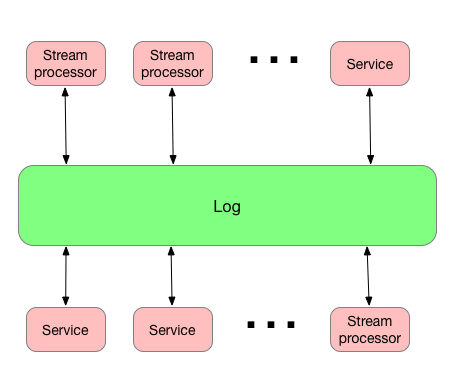

# Dynamically controlled streams

This is a repo for all dynamically controlled streams implementation. See [this write up](https://docs.google.com/document/d/11Kpja8YGd8jcYvwH_DjPgBjqBjH2jLARI5O9-mO7hJQ/edit?pli=1#) for details.

## Pattern definition
An enterprise has multiple service that are being built independently, with different languages and platforms, that need to be used in stream processing.

**How can I use these services inside stream processing?**

**Have each service produce data (as it changes) to the “control” stream for the stream processing to consume and use as a “state” that can be used by the data stream to produce results.** 

##Architecture

The overall architecture is based on the Log-centric execution architecture introduced by [Jay Kreps](https://engineering.linkedin.com/distributed-systems/log-what-every-software-engineer-should-know-about-real-time-datas-unifying).

Log represents a centralized subsystem with a well defined API for adding and retrieving data. In the case of a log-centric architecture, there is no interconnectivity between services. Any data a producer adds to the log is available to any consumers that have access to the log. The log just stores data sequentially (time sequence) without any attempts to manage producers and consumers of data. Additionally logs allow replay of messages in cases where some of the consumers have to be replaced.

With the log centric execution architecture in place, a dynamically controlled streams architecture can be a better alternative to the RPC-based service invocation from within stream.

##What is in this project?

The project has several modules:
* akkastreamcontroller - implementation using Akka Streams
* flinkcontroller - implementation using Flink
* heater - implementation of the common sample
* kafkastreamscontroller - implementation using Kafka Streams
* project - project artifacts (versions, dependencies, etc.)
* protobufs - definitions of the messages used
* sparkcontroller - implementation using Spark Streaming
* support - supporting code shared by other project